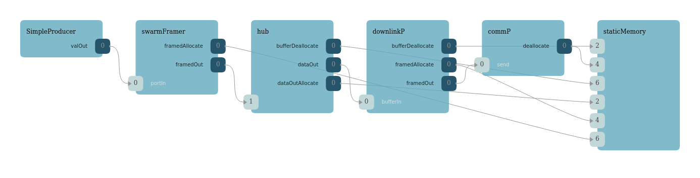

# Multi-Node Mesh Network (Swarm Network)

This Repository contains the Fprime deployment project DepA, a mesh_network-drivers folder, and the fprime repository as a submodule. 

The mesh_network-drivers contains MultiTcpServer, which is an experimental multi nodal communication driver, that uses the Drv/ByteStreamDriverModel as its component interface.

The DepA deployment is an example that uses the MultiTcpServer implementation. Multiple instances of DepA are run, and all will connect and pass data between each other. 

## About 
This deployment uses a custom implementation of the byte stream driver model, [Multi Tcp Server](mesh_network-drivers/MultiTcpServer/), to allow data passing within a mesh network. Each node in the mesh network is a stand alone Fprime Deployment, and each deployment can be identical. 

To make each node unique, they will have their own Swarm ID. Below is an example of the data packet as it arrives to the Multi Tcp Server component before it is transmited over the TCP protocol: 

The swarm header works in the similar way to the TCP's source and destination fields. 

A Multi Tcp Server consists of a Multi-Threaded TCP Server and multiple TCP Client Sockets. The TCP Server will listen and accept incoming TCP Client connection requests, and relegate data receiving to a read thread per client, similar to the current operation in [Drv/Ip/SocketReadTask.hpp](../Drv/Ip/SocketReadTask.hpp). This handles receiving data from other Nodes in the network. 

The multiple TCP Client Sockets handle sending data out to other Nodes in the network. The [node host file](node_host_file_0.txt) contains a list of Ip-addresses and ports of the other nodes in the network. The [socket open task](../Drv/MultiTcpServer/SocketOpenTask.hpp) will read an entry in the file, configure a TCP Client Socket, and attempt to connect to the other Node. On successesfull TCP handshake, the receiving node and sending node will do a Swarm handshake.

For the swarm handshake, the client side will send the swarm device's ID. The server, on receiving the device ID, will send its own device ID. The client receiving the server's device ID will store it within the [Multi Tcp Client Socket](../Drv/MultiTcpServer/MultiTcpClientSocket.hpp). When data to be sent comes into the component, the data packet will be scanned to find the Receiver/Destination ID, and send the data through the TCP Client socket that is connected to the appropriate node. 

A TCP Client within a node may also connect to the node's TCP Server for loop back operation. 

## This Example Deployment
This Example Deployment features a Simple Producer, Simple Receiver component. and a GPS component. 

## Simple Producer
The Simple producer takes in a command to set number. Setting the number sends the same number to an output port, go through the downlink, and uplink topologies as shown below, and into a Simple Receiver Component, where it outputs a low priority event that it received a number. 

### Downlink Topology

### Uplink Topology
 

## GPS
For now, Earth Centered Earth Fixed coordinate data is simulated with rand(). 

The GPS, connected with the 1Hz rate group 1 component, will poll for GPS data, and send it out through the downlink chain to a destination node. On receiving GPS data, the component will poll its own GPS position and calculate the distance to the other node using the incoming GPS data.

## Swarm Framer and Deframer
The Swarm framer frames the data producing component's data with the swarm header into a buffer, before passing the buffer into the generic hub's buffersIn ports. For now, the swarm framer is initialized with the node's device ID for the sender/source ID, while also initializing the receiver/destination ID as the same to the node's device ID for loop back. 

The Swarm Deframer removes the swarm header before passing the data to the data receiving component. 

## To run the example for a 5 Node network

Modify the Ip config in the fprime repository. Modify [ACConstants.fpp](fprime/config/AcConstants.fpp), line 255. Change `StaticMemoryAllocations` = 10

[node_hostfile_0.txt](DepA/node_hostfile_0.txt) contains a list of IP addresses and port numbers in the format <IP_address:port_number>. These are TCP targets that the MultiTcpServer component will use to connect to for out-going messages. 

[commands_to_run.txt](DepA/commands_to_run.txt) contains fprime-gds and deployment commands to run instances of fprime-gds and deployments. 

Fprime-GDS command: `fprime-gds -n --gui-port 5000 --tts-port 50050 --ip-port 51000`

DepA executable command: `./build-artifacts/Linux/bin/DepA -a 0.0.0.0 -p 51000 -j 127.0.1.1 -g 50100 -d 538976288`

Arguments: 
* -a : IP address of the fprime-gds instance. 0.0.0.0 all IPv4 addresses on the host machine. 
* -p : port number of the fprime-gds instance. It matches with `--ip-port`
* -j : IP address of the deployment's MultiTcpServer TCP interface. 
* -g : port number of the deployment's MultiTcpServere TCP interface. 
* -d : The deployments swarm ID. 538976288 is the decimal value of 0x20202020. 

Make sure that the `-j` and `-g` arguments match to the entires in the node_hostfile. Alternatively, you can have the same IP address for `-j`, but have different port numbers for `-g`. 

Example for a 5 Node network on Linux (tested on Ubuntu 20.04). Assuming you can build and run `fprime-gds` for the `/Ref` example.

1. Within the `/DepA` directory, run `fprime-gds build` 
2. Open up 10 Terminals, and navigate into `/DepA`
3. For 5 terminals, run the fprime-gds commands to open a fprime-gds instance. The commands can be found in [commands_to_run.txt](DepA/commands_to_run.txt). 
    - Alternatively: run the command: `python rungds.py 5` 
4. For the next 5 terminals, run each command to start a deployment instance. The commands can be found in [commands_to_run.txt](DepA/commands_to_run.txt)

Suggesetions to streamline the above process will be appreciated. 