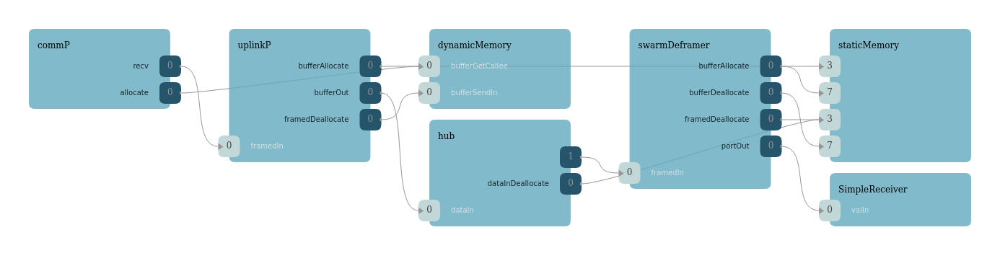

\page DrvMultiTcpServer Multi Threaded Tcp Server Component
# Drv::MultiTcpServer Multi Threaded Tcp Server Component

This Multi-Tcp Server Component features a Multi-threaded TCP Server and multiple TCP Clients. The multi-threaded TCP server listens and accepts connections from other multi-Tcp Clients. Data being recieved would come from the Tcp server interface. The multiple Tcp Clients will connect to other Tcp Servers. Data being sent out, will be through the Tcp Client intervace.  

Since this component inclused a server, it must startup and listen for client connections. The client sockets, will attempt to establish connections to other servers. 

### Top Level Tasks
The Accept task polls the TCP Server manager to get an open a socket, which will return a success if there is a client attempting to connect. Once a client connects, the Accept task will find an available Task handler and start the read task for that client on that thread to a maximum of `MAX_CLIENTS` 

The Socket Open task, reads a text file with entries on ip address and port information of other servers. With each entry, the task will first check if another client socket is open and connected to the same host, if not, then it configures an available Tcp Client socket, and attempts to connect to it.  

For more information on the ByteStreamModelDriver see: Drv::ByteStreamDriverModel.

## Swarm Protocol

This multi-Tcp Server Component follows a swarm protocol. A deployment using this component must have a hardcoded and unique 4-byte DeviceID. The DeviceID must be unique for identification and communication between a swarm of identically set up Space Vehicles. 

When a Client Socket connects to the Server socket, the client will initially send its DeviceID to the server. The server will receive it, and store the DeviceID, HostName, and Port within the MultiTcpServerSocket object. Then, the server will send it's own DeviceID. The client Socket will receive it, and store the DeviceID, HostName, and Port of the server within the MultiTcpClient Socket object. 

When a deployment uses this component to send data to another component, the data packet must included the swarm header. Before sending, the component will scan the data packet to find the destination ID. The destination ID can then be used with the MultiTcpClient Manager to find the MultiTcpClient socket that is connected to the destination device and send data on the appropriate socket. 

On receiving data, when the TcpServer accepts a client connection, it opens a thread to continuously read from the socket. When data comes in from the receive call, the component will forward the data up the uplink chain of components. When the client side socket closes, (addition, on read timeout or other TCP error), the read loop will be stopped, the socket connection closed, and the thread will end. 

This component should be used in conjuction with the buffer manager, generich hub, Framer, and Deframer as shown below. 

**Downlink Topology**


**Uplink Topology**

## Design

Another component connected to the Multi Tcp Server component will initiates the transfer of send data by calling the "send" port.
The caller will provide a `Fw::Buffer` containing the data to send and the port call will return a status of that send.
These responses are an enumeration whose values are described in the following table:

| Value | Description |
|---|---|
| Drv::SEND_OK    | Send functioned normally. |
| Drv::SEND_RETRY | Send should be retried, but a subsequent send should return SEND_OK. |
| Drv::SEND_ERROR | Send produced an error, future sends likely to fail. |

This data is immediately sent out to the remote partner with a configured send timeout. See Usage described below.

**Callback Formation**


In the callback formation, the byte stream driver component initiates the transfer of received data by calling the
"readCallback" output port. This port transfers any read data in a `Fw::Buffer` along with a status for the receive.
This status is an enumeration whose values are described in the following table:

| Value | Description |
|---|---|
| Drv::RECV_OK    | Receive functioned normally buffer contains valid data. |
| Drv::RECV_ERROR | Receive produced an error and buffer contains no valid data. |

## Usage

The Drv::MultiTcpServerComponentImpl must be configured with the address of the remote connection, and the socket must be
open to begin. Usually, the user runs the Drv::MultiTcpServerComponentImpl engaging its Accept thread, which will listen for connections, accepts, and delegates reading from that specific client onto a
read thread. The component is passive and has no commands meaning users should `init`, `configure`, and
`startAcceptTask`. In addition to these methods shared with the Drv::MultiTcpClientComponentImpl, the server provides
`startup` and `shutdown` methods to start and stop the listening socket. It `startup` must be run before the Accept task
is started and `shutdown` should be called before the task is stopped.

Upon shutdown, the `stopAcceptThread` and `joinAcceptThread` methods should be called to ensure
proper resource deallocation. This typical usage is shown in the C++ snippet below.


```c++
Drv::MultiTcpServerComponentImpl comm = Drv::MultiTcpServerComponentImpl("TCP Server");

bool constructApp(bool dump, U32 self_port_number, char* self_hostname, U32 devID, char* hostfile_name) {
    ...
    commP.init(0);
    ...
    if (hostname != nullptr && port_number != 0) {
        Os::TaskString name("commP.Accept");
        commP.configure(self_hostname, self_port_number); 
        if(devID == 0){
            commP.setDeviceID(0x20202020); //a generic base device address
        }
        else{
            commP.setDeviceID(devID); 
        }
        commP.setHostFile(hostfile_name, sizeof(hostfile_name));
        commP.startup();

        commP.startAcceptTask(name, true, true, Os::Task::TASK_DEFAULT, Os::Task::TASK_DEFAULT, Os::Task::TASK_DEFAULT); 
        
        name = "commP.Open"; 
        commP.startSocketOpenTask(name, true, Os::Task::TASK_DEFAULT, Os::Task::TASK_DEFAULT, Os::Task::TASK_DEFAULT);
        
    }
}

void exitTasks() {
    ...
    commP.shutdown(); 
    commP.stopAcceptTask();
    commP.stopSocketOpenTask(); 
    (void) commP.joinAcceptTask(nullptr);
    (void) commP.joinSocketOpenTask(nullptr); 
}
```
## Class Diagram


## Requirements

| Name | Description | Validation |
|---|---|---|
| TCP-SERVER-COMP-001 | The tcp server component shall implement the ByteStreamDriverModel  | inspection |
| TCP-SERVER-COMP-002 | The tcp server component shall provide a read thread | unit test |
| TCP-SERVER-COMP-003 | The tcp server component shall provide bidirectional communication with a tcp client | unit test |

## Change Log

| Date | Description |
|---|---|
| 2020-12-21 | Initial Draft |
| 2021-01-28 | Updated |
